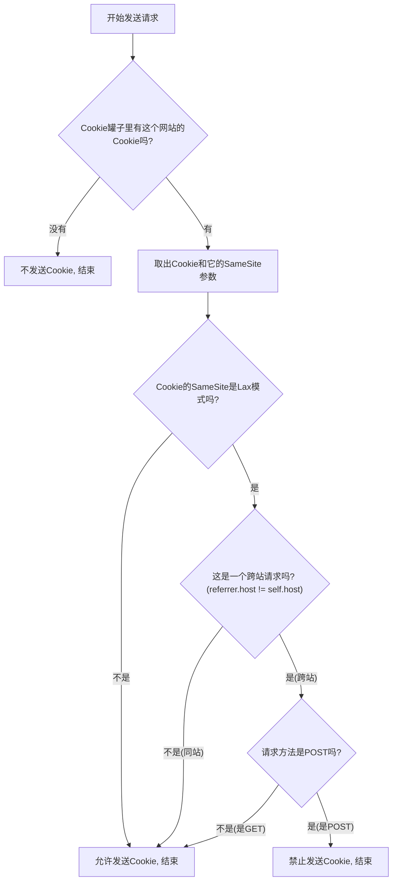

### 核心目标：防止CSRF攻击

我们先忘掉代码，回顾一下CSRF攻击（跨站请求伪造）的场景：

1.  你登录了你的银行 `bank.com`，浏览器存下了你的登录凭证Cookie。
2.  你访问了一个恶意网站 `evil.com`。
3.  `evil.com` 上有一个隐藏的表单，它会自动向 `bank.com/transfer` 发送一个POST请求，企图转账。
4.  **关键点**：你的浏览器在发送这个请求时，会**自动、无条件地**把 `bank.com` 的Cookie也一起带上。
5.  `bank.com` 的服务器收到请求，看到了合法的Cookie，以为是你本人在操作，于是转账成功。

`SameSite` Cookie 的目的就是为了解决第4步中\*\*“自动、无条件地”**这个问题。它要给浏览器一个规则，让浏览器在某些情况下**“不要”\*\*自动发送Cookie。

-----

### `SameSite` 是如何工作的？

`SameSite` 是服务器在设置Cookie时，给浏览器下达的一个“指令”。

  * **服务器的角色**：在发送 `Set-Cookie` 响应头时，附加一个 `SameSite` 属性，比如 `Set-Cookie: token=...; SameSite=Lax`。
  * **浏览器的角色**：收到这个指令后，浏览器会遵守它。当未来要向这个网站发送请求时，浏览器会先判断一下情况，再决定要不要带上这个Cookie。

**`SameSite=Lax` 的规则是什么？**

`Lax` 的意思是“不那么严格”，它的规则可以通俗地理解为：

> “当一个请求是从**别的网站**（跨站）跳转过来的时候，如果这个请求是 `GET` 请求（比如点个链接），那我就带上Cookie；但如果这个请求是 `POST` 请求（比如提交表单），那我就**不带**Cookie了！”

现在我们再看CSRF攻击，攻击者在 `evil.com` 上伪造的是一个向 `bank.com` 的 `POST` 请求。如果 `bank.com` 的Cookie被设置了 `SameSite=Lax`，那么浏览器在处理这个来自 `evil.com` 的跨站POST请求时，就会决定**不发送Cookie**。`bank.com` 的服务器收不到Cookie，自然就拒绝了转账请求。攻击失败！

-----

### 代码是如何实现这个逻辑的？

现在我们来看代码，代码就是在模拟浏览器实现上述规则。

#### 第一步：存储 `SameSite` 属性

```python
# 服务器返回的原始 Set-Cookie 头
# "token=abcde12345; SameSite=Lax"

def request(self, payload=None):
    if "set-cookie" in response_headers:
        cookie_header = response_headers["set-cookie"]
        
        # 将 "token=abcde12345" 和 "SameSite=Lax" 分开
        cookie_value, rest_params = cookie_header.split(";", 1) 
        
        params = {}
        # 解析 "SameSite=Lax"
        # 结果是 params = {'samesite': 'lax'}
        for param_str in rest_params.split(";"):
            # ... 省略解析细节 ...
            params[param_name] = param_value
        
        # COOKIE_JAR 中存储了三样东西：
        # 1. 域名 (self.host)
        # 2. Cookie的值 ("token=abcde12345")
        # 3. Cookie的参数 ({'samesite': 'lax'})
        COOKIE_JAR[self.host] = (cookie_value, params)
```

这段代码的作用就是当浏览器收到服务器的 `Set-Cookie` 头时，不再像以前一样只存一个简单的 `key=value`，而是把它附带的参数（比如 `SameSite=Lax`）也解析出来，存进一个专门的地方（`COOKIE_JAR`）。

#### 第二步：判断请求的来源（Referrer）

为了判断一个请求是不是“跨站”的，浏览器必须知道两件事：

1.  **请求的目标是谁？** (e.g., `bank.com`)
2.  **请求是从哪里发起的？** (e.g., `evil.com`)

这个“发起请求的页面”就被称为 **`referrer`**（来源）。所以代码里给 `request` 函数增加了一个 `referrer` 参数，用来追踪这个信息。

  * 当你在地址栏里直接输入网址按回车时，没有来源页面，所以 `referrer` 是 `None`。
  * 当你在 `a.com` 页面上点击一个链接跳转到 `b.com` 时，`b.com` 请求的 `referrer` 就是 `a.com`。

#### 第三步：执行 `SameSite=Lax` 规则

这是最核心的逻辑，把前面所有的信息都用上了。

```python
def request(self, referrer, payload=None):
    if self.host in COOKIE_JAR:
        cookie, params = COOKIE_JAR[self.host]
        
        # 默认允许发送Cookie
        allow_cookie = True 
        
        # 开始检查 SameSite=Lax 规则
        # params.get("samesite", "none") == "lax" 的意思是：
        #   如果Cookie设置了samesite参数，就取它的值，如果没有，就默认是"none"
        #   然后判断这个值是不是"lax"
        if referrer and params.get("samesite", "none") == "lax":
            # 这是一个有来源页面，且Cookie是Lax模式的请求
            
            # 判断请求方法是不是GET
            if method != "GET": 
                # 如果不是GET（比如是POST），这就是一个跨站POST请求
                
                # 检查来源和目标是不是同一个域名
                # 如果 self.host (目标) 和 referrer.host (来源) 不一样
                # 那就说明是跨站的
                if self.host != referrer.host:
                    # 触发规则！禁止发送Cookie！
                    allow_cookie = False
        
        # 最后，根据 allow_cookie 的值决定是否在请求头里加上Cookie
        if allow_cookie:
            request += "Cookie: {}\r\n".format(cookie)
```

**用一个流程图来梳理这个逻辑：**



### 总结

所以，整个流程就是：

1.  **存储指令**：服务器通过 `Set-Cookie: SameSite=Lax` 给浏览器下一个指令。浏览器解析并记住这个指令。
2.  **追踪来源**：浏览器在发起每个请求时，都会记录下这个请求是从哪个页面（`referrer`）发起的。
3.  **执行决策**：当要发送请求时，浏览器会检查`SameSite`指令。如果指令是`Lax`，并且发现这是一个**跨站的POST请求**，它就会阻止自己自动携带Cookie的行为。

这就实现了对CSRF攻击的有效防御，所以它被称为“深度防御”或“故障保险”，因为它不依赖于开发者是否在每个表单里都写对了CSRF Token，而是从浏览器层面提供了一层保护。