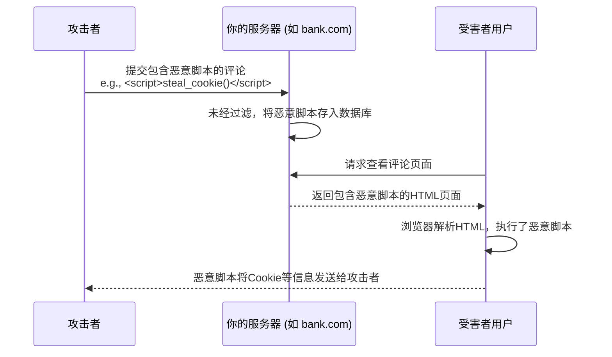

简单来说：

- **同源策略 (SOP)**：防止 **“读取”**。防止一个网站去偷看另一个网站的内容。
    
- **跨站脚本 (XSS)**：防止 **“执行”**。防止你的网站被注入恶意代码，然后以你的名义去害你的用户。
    
- **跨站请求伪造 (CSRF)**：防止 **“发送”**。防止你的用户在不知情的情况下，从别的网站向你的网站发送恶意请求。
    

下面我们来逐一拆解。

---

### 1. 同源策略 (Same-Origin Policy, SOP)

- 问题出在哪里？
    
    问题的核心是信任和隔离。浏览器可以同时打开多个窗口或标签页，比如你的银行页面和另一个普通新闻页面。如果没有同源策略，新闻页面里的JavaScript脚本就可以随意读取你银行页面的DOM结构，获取你的余额、交易记录等所有敏感信息。这是绝对不能允许的。
    
- 对策是什么？为什么？
    
    对策就是同源策略。浏览器强制规定，只有来自**相同源（协议、域名、端口都相同）**的脚本，才能读取该源的资源。
    
    它就像一堵墙，把不同源的页面隔离开。当 `a.com` 的脚本想用 `XMLHttpRequest` 或 `fetch` API 去**读取** `b.com` 的数据时，浏览器会进行检查：
    
    1. 浏览器发现这是一个**跨源请求**。
        
    2. 浏览器会向 `b.com` 发送请求，并带上一个 `Origin: https://a.com` 的HTTP头。
        
    3. `b.com` 的服务器必须在响应头里返回 `Access-Control-Allow-Origin: https://a.com` (或者 `*`)。
        
    4. 浏览器检查响应头，如果发现许可，才把数据交给 `a.com` 的脚本。否则，即使数据已经下载了，浏览器也会**拒绝将数据交给脚本**，并报错。
        
    
    **所以，SOP的主要目标是控制跨源的“读”权限。**
    
- 为什么SOP不能防御CSRF？
    
    这是最关键的一点。CSRF攻击的目的不是“读取”响应，而是成功“发送”一个请求。
    
    想象一下，你登录了银行 `bank.com`。然后你访问了一个恶意网站 `evil.com`，上面有一个图片：``。
    
    1. 你的浏览器看到这个 `` 标签，会认为它只是想加载一张图片，这是一个合法的跨域资源加载行为（和加载JS、CSS一样，是被允许的）。
        
    2. 浏览器会**自动带上**你所有 `bank.com` 的Cookie（因为这是银行的URL）。
        
    3. `bank.com` 的服务器收到这个请求，看到合法的Cookie，以为是你本人在操作，于是转账成功。
        
    
    在这个过程中，`evil.com` 的脚本**根本不需要读取** `bank.com` 的任何返回信息。它只需要这个请求被成功发送并执行就行了。同源策略拦截的是返回数据的读取，但对于这种“有去无回”的攻击请求，它无能为力。
    

---

### 2. 跨站脚本攻击 (Cross-Site Scripting, XSS)

- 问题出在哪里？
    
    问题的核心是网站本身过于信任用户输入的内容。当一个网站允许用户提交评论、文章等内容，却没有对内容中可能包含的 `<script>` 标签等进行过滤或转义，攻击者就可以把恶意脚本“存”在你的数据库里。
    
    当其他用户访问这个页面时，服务器会把包含恶意脚本的内容原封不动地返回给用户浏览器。浏览器看到 `<script>` 标签，会认为这是网站自己的合法脚本，于是就**执行**了它。
    
- **攻击原理的Mermaid图：**
    
    

    
- 对策是什么？为什么？
    
    对策的核心是**“不信任任何用户输入”**。
    
    1. **输入转义 (Escaping)**：在服务器端，将用户输入的特殊字符（如 `<`、`>`、`"`）转换成HTML实体（如 `&lt;`、`&gt;`、`&quot;`）。这样浏览器只会把它们当作普通文本显示出来，而不会当作HTML标签来解析和执行。这是最根本的防御手段。
        
    2. **内容安全策略 (Content Security Policy, CSP)**：由服务器发送一个HTTP头，告诉浏览器一个“白名单”，规定只允许加载和执行来自特定源的脚本。这相当于给XSS攻击加了最后一道防线。即使恶意脚本被注入到页面里，由于它不符合CSP规则（比如内联脚本被禁止），浏览器也会拒绝执行它。
        

---

### 3. 跨站请求伪造 (Cross-Site Request Forgery, CSRF)

- 问题出在哪里？
    
    问题的核心是浏览器在跨站请求中“太热心”，会自动携带身份凭证 (Cookie)。它利用了网站对用户Cookie的信任。攻击者无法窃取Cookie，但可以诱导用户的浏览器去使用这个Cookie。
    
- **攻击原理的Mermaid图：**
    
    
    ```mermaid
    sequenceDiagram
        participant Victim as 受害者用户
        participant MaliciousSite as 恶意网站 (evil.com)
        participant TrustedSite as 受信任的网站 (bank.com)
    
        Victim->>TrustedSite: 正常登录，浏览器保存 bank.com 的Cookie
        Victim->>MaliciousSite: 访问恶意网站
        MaliciousSite-->>Victim: 返回一个页面，内含自动提交的表单或图片<br>e.g., <form action="https://bank.com/transfer">...</form>
        Victim->>Victim: 浏览器自动提交表单到 bank.com
        note right of Victim: 请求中自动带上了 bank.com 的Cookie
        Victim-->>TrustedSite: 发送伪造的转账请求
        TrustedSite->>TrustedSite: 验证Cookie成功，执行转账操作
    ```
    
- 对策是什么？为什么？
    
    对策的核心是验证请求的来源，确保请求是用户主观意愿发出的。
    
    1. **SameSite Cookie 属性**：这是现代浏览器提供的最有效的防御。通过在设置Cookie时声明 `SameSite=Strict` 或 `SameSite=Lax`，可以告诉浏览器在跨站请求中不要携带这个Cookie。这样，从 `evil.com` 发往 `bank.com` 的请求就不会带上身份凭证，攻击自然就失败了。
        
    2. **CSRF Token**：这是一种传统的、依然非常有效的防御。服务器在生成表单页面时，会嵌入一个随机、不可预测的令牌（Token）。当用户提交表单时，这个令牌会一起被发送。服务器在处理请求时，会验证这个令牌是否匹配。因为攻击者在 `evil.com` 上无法预知这个令牌是什么，所以他伪造的请求里就不会有正确的令牌，请求就会被拒绝。
        

### 总结与对比

|特性|同源策略 (SOP)|跨站脚本 (XSS)|跨站请求伪造 (CSRF)|
|---|---|---|---|
|**攻击目标**|读取**另一个网站**的敏感数据|在**目标网站**上执行恶意脚本，窃取用户数据或冒充用户|借用用户的身份，向**目标网站**发送恶意请求|
|**核心问题**|浏览器不同源之间的**数据隔离**问题|网站**信任了用户的输入**，导致代码注入|网站**信任了来自其他网站的请求**中附带的Cookie|
|**攻击者视角**|“我想看`b.com`的数据，但我的脚本在`a.com`”|“我想在`b.com`上运行我的脚本”|“我想让已经登录`b.com`的用户，帮我向`b.com`发送一个请求”|
|**主要对策**|浏览器内置策略 + CORS (`Access-Control-Allow-Origin`)|输入转义 + 内容安全策略 (CSP)|SameSite Cookies + CSRF Tokens|

希望这个详细的解释能帮你彻底弄清楚它们之间的区别和联系！