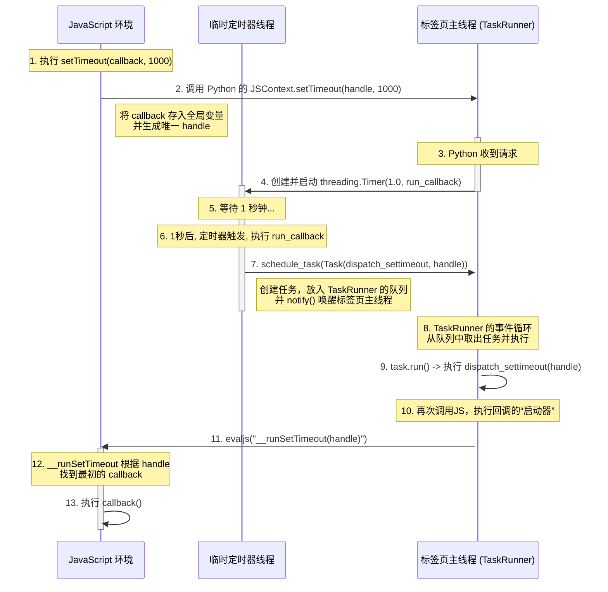

整个流程涉及三个关键角色：

1.  **JavaScript 环境 (JS):** 用户代码运行的地方。
2.  **一个临时的定时器线程 (Timer Thread):** 由 `threading.Timer` 创建，专门用来等待指定的时间。
3.  **标签页主线程 (Tab's Main Thread):** 负责执行所有页面相关的任务，包括最终的JS回调。

下面是 `setTimeout(callback, 1000)` 被调用时的完整流程图，详细解释了每一步的交互：

### 流程详解

1.  **发起调用 (在 `runtime.js`):**

      * 当你在JS中调用 `setTimeout(myCallback, 1000)` 时，`runtime.js` 中的 `setTimeout` 函数被执行。
      * 它将你的 `myCallback` 函数存储在一个全局对象 `SET_TIMEOUT_REQUESTS` 中，并为其分配一个唯一的数字句柄 `handle`。
      * 它立即通过 `dukpy` 的桥梁调用 Python 端的 `JSContext.setTimeout` 方法，并传入 `handle` 和 `1000`。

2.  **设置定时器 (在 `browser.py`):**

      * Python 中的 `JSContext.setTimeout` 方法接收到调用。
      * 它**不会阻塞**，而是立刻创建一个 `threading.Timer` 对象。这个对象会启动一个**新的、临时的线程**。
      * 这个新的定时器线程的任务很简单：等待 `1.0` 秒，然后执行 `run_callback` 函数。

3.  **定时器触发与任务调度 (在 `browser.py`):**

      * 1秒钟后，在那个临时的**定时器线程**里，`run_callback` 函数被执行。
      * `run_callback` 的工作是封装一个 `Task` 对象。这个任务的目标是执行 `JSContext.dispatch_settimeout` 方法，并把之前那个 `handle` 作为参数。
      * 它调用 `self.tab.task_runner.schedule_task(task)`，将这个新任务放入**标签页主线程**的任务队列中，然后通过 `condition.notify()` 唤醒可能正在休眠的主线程。

4.  **执行回调 (回到 `browser.py` 和 `runtime.js`):**

      * **标签页主线程**在其 `run()` 循环中，发现了队列里的新任务，于是取出并执行 `task.run()`，这实际上是调用 `JSContext.dispatch_settimeout(handle)`。
      * `dispatch_settimeout` 方法再次通过 `dukpy` 的桥梁，调用回 **JavaScript 环境**，执行 `SETTIMEOUT_JS` 里的 `__runSetTimeout` 函数。
      * `__runSetTimeout` 使用 `handle` 从 `SET_TIMEOUT_REQUESTS` 中找回最初的 `myCallback` 函数，并最终执行它 `callback()`。

这个流程最精妙的地方在于 **线程的切换**：
JS调用 -\> Tab主线程 -\> **新定时器线程** (等待) -\> Tab主线程 (调度) -\> JS执行。

通过这种方式，一个耗时的等待操作被外包给了一个临时线程，完全不会阻塞主线程对用户输入、页面渲染等其他任务的处理。