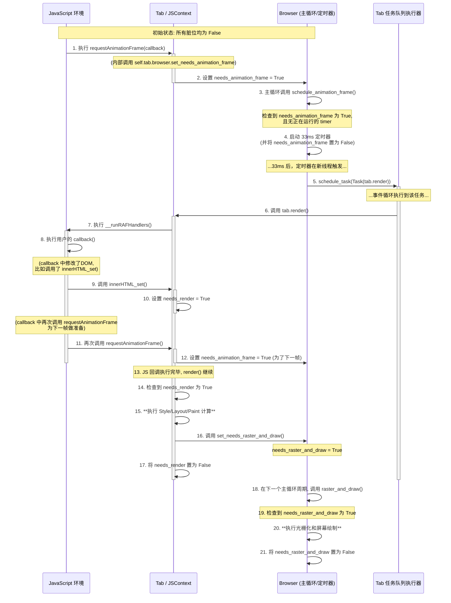

这个例子将模拟一个典型的动画循环：JavaScript 代码请求一帧，修改DOM，然后再次请求下一帧。

### `requestAnimationFrame` 完整流程时序图

这张图详细展示了从JS发起请求，到浏览器各个模块协作，再到最终屏幕更新的每一步，以及三个关键脏位 (`needs_animation_frame`, `needs_render`, `needs_raster_and_draw`) 的状态变化。

### 流程详解

1.  **请求 (1-2)**: JavaScript 调用 `requestAnimationFrame`。在 `runtime.js` 中，这会调用到 Python 端的 `JSContext.requestAnimationFrame`。该方法接着调用 `browser.set_needs_animation_frame`，将 `needs_animation_frame` 脏位置为 `True`。

2.  **调度 (3-5)**: 浏览器的主循环 (`mainloop`) 在运行时调用 `schedule_animation_frame`。它检测到 `needs_animation_frame` 为 `True`，于是启动一个33毫秒的定时器，这个定时器到期后会向 `TaskRunner` 的队列中放入一个 `render` 任务。

3.  **执行 `render` 与 JS 回调 (6-8)**: `TaskRunner` 从队列中取出任务并执行 `tab.render()`。`render` 方法做的第一件事就是通过 `evaljs` 执行 `__runRAFHandlers`，这会触发之前在JS中注册的 `callback`。

4.  **DOM变更与下一帧请求 (9-12)**:

      * 在JS的`callback`执行期间，它修改了DOM（例如通过`innerHTML`），这会调用到Python端的`innerHTML_set`，从而将 `needs_render` 脏位置为 `True`。
      * 为了动画的连续性，`callback` 通常会再次调用 `requestAnimationFrame`，这将再次将 `needs_animation_frame` 置为 `True`，为下一个渲染周期做好准备。

5.  **完成渲染 (13-17)**:

      * JS回调执行完毕后，`render` 方法继续执行。它检查到 `needs_render` 为 `True`，所以它会继续完成耗时的样式计算和布局。
      * 成功生成新的绘制列表后，它调用 `set_needs_raster_and_draw` 将 `needs_raster_and_draw` 脏位置为 `True`，同时将 `needs_render` 重置为 `False`。

6.  **屏幕绘制 (18-21)**:

      * 浏览器主循环 (`mainloop`) 在后续的循环中调用 `raster_and_draw`。它检测到 `needs_raster_and_draw` 为 `True`，于是执行真正的屏幕绘制操作。
      * 绘制完成后，它将 `needs_raster_and_draw` 重置为 `False`，整个浏览器回归到“干净”状态，等待下一轮动画帧的到来。