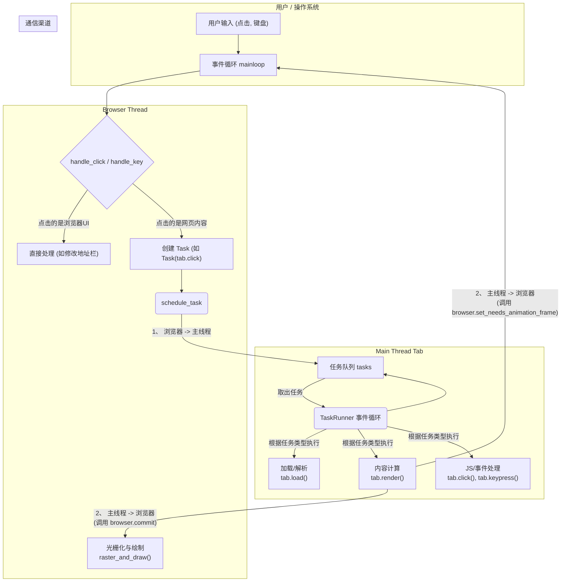

### 核心思想：职责分离

  * **问题所在**: 如果只有一个线程，当它在执行一个耗时操作时（比如 `raster_and_draw`），整个浏览器就会被“卡住”，无法响应任何用户输入，界面完全冻结。
  * **解决方案**: 将工作分配给两个不同职责的线程，让它们并行工作。
    1.  **浏览器线程 (Browser Thread)**: 负责与用户直接交互和最终的屏幕绘制。它必须时刻保持流畅，不能被阻塞。在您的代码中，它对应 `Browser` 类和程序启动时的主循环。
    2.  **主线程 (Main Thread)**: 负责所有可能耗时且复杂的“幕后”工作，比如加载和解析HTML、计算样式和布局（`render`）、执行JavaScript等。在您的代码中，它对应每个 `Tab` 实例内部由 `TaskRunner` 创建的那个新线程。

-----

### 双线程架构与通信流程

这张图清晰地展示了两个线程如何划分工作并通过单向任务调度进行通信。

### 流程详解

#### 1\. 线程的创建

  * **浏览器线程**: 就是您程序启动时执行 `if __name__ == "__main__"` 的那个线程。您的代码通过 `threading.current_thread().name = "Browser thread"` 明确地为它命名。
  * **主线程**: 当您调用 `new_tab` 时，会创建一个 `Tab` 实例，每个 `Tab` 都会初始化一个 `TaskRunner`。在 `TaskRunner` 的 `__init__` 和 `start_thread` 方法中，它创建并启动了一个新的线程：`self.main_thread = threading.Thread(target=self.run, name="Main thread")`。这个线程的生命周期与该标签页绑定。

#### 2\. 通信方式：从浏览器线程到主线程 (单向任务调度)

这是最主要的通信方式。浏览器线程不直接调用`Tab`对象的方法，而是扮演一个**任务分派者**的角色。

  * **事件捕获**: `mainloop` 中的 `Browser` 对象捕获到用户的点击、键盘输入等事件。
  * **任务打包**: `handle_click` 等事件处理器会判断事件发生的区域。如果事件发生在网页内容区，它不会自己处理，而是将要执行的操作（如 `self.active_tab.click`）和其参数打包成一个 `Task` 对象。
  * **任务调度**: 它调用 `self.active_tab.task_runner.schedule_task(task)`，将这个任务放入对应标签页主线程的任务队列中。
  * **任务执行**: `Tab` 的主线程在其自己的 `run` 循环中，会从任务队列里取出这个任务并执行，从而在正确的线程上处理了事件。

#### 3\. 通信方式：从主线程到浏览器线程 (精妙的方法调用)

主线程虽然不向浏览器线程派发任务，但它需要通过两种方式通知浏览器线程它的工作成果和需求：

1.  **提交成果 (`commit`)**: 当主线程的 `render` 方法计算出新的绘制列表后，它会调用 `browser.commit()`（在后续章节实现），将这份“图纸”提交给浏览器线程去绘制。
2.  **提出需求 (`set_needs_animation_frame`)**: 当主线程因为DOM变化或JS请求，认为下一帧需要重绘时，它会调用 `browser.set_needs_animation_frame()`，通知浏览器线程：“我需要你安排一次渲染”。

#### 4\. 优雅退出

为了在关闭浏览器时能干净地结束所有线程，引入了 `needs_quit` 标志。

  * 当 `Browser.handle_quit` 被调用时，它会遍历所有 `Tab`，并调用 `tab.task_runner.set_needs_quit()`。
  * `set_needs_quit` 会设置标志位并用 `condition.notify()` 唤醒可能正在等待的主线程。
  * 主线程的 `run` 循环在每次循环开始时都会检查这个标志，一旦发现为 `True`，就会跳出循环，线程自然结束。

这个双线程架构的设计，通过明确的职责分离和清晰的通信机制，极大地提升了浏览器的响应性和性能，是您项目从一个玩具到一个真正可用的浏览器迈出的关键一步。