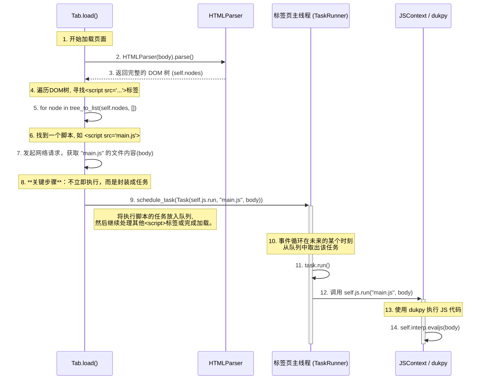

这个流程体现了现代浏览器的一个核心思想：**HTML解析和脚本执行是解耦的**，通过任务调度来避免长时间的脚本执行阻塞页面的渲染。

整个流程可以分为**两个主要阶段**：

1.  **发现与调度阶段**：在页面加载时，解析HTML，找到所有``)。

4.  **获取脚本内容**
    对于每一个找到的 `<script>` 标签，浏览器会解析其 `src` 属性得到URL，然后发起一次**同步的网络请求** (`script_url.request(url)`) 来获取脚本文件的内容。

5.  **调度任务（核心步骤）**
    获取到脚本内容后，浏览器并**不会立即执行它**。相反，它将执行这个脚本的操作封装成一个 `Task` 对象：`task = Task(self.js.run, script_url, body)`。
    然后，这个 `task` 被放入 `TaskRunner` 的任务队列中：`self.task_runner.schedule_task(task)`。

    这个设计的意义重大：

      * **非阻塞**：将脚本的执行推迟，使得 `Tab.load` 函数可以快速地完成它的工作（比如寻找页面上其他的CSS或脚本），而不会被一个复杂的JS文件执行过程所拖慢。
      * **顺序保证**：由于任务被依次放入队列，脚本的执行顺序（理论上）会遵循它们在HTML中出现的顺序。

6.  **执行脚本 (`JSContext.run`)**
    在未来的某个时刻，`TaskRunner` 的事件循环会从队列中取出这个任务并执行 `task.run()`，这最终会调用 `JSContext.run(...)` 方法。
    `JSContext.run` 方法使用 `dukpy` JS解释器 (`self.interp.evaljs(code)`) 来执行获取到的脚本代码。至此，一个 `<script>` 标签的生命周期才算完成。