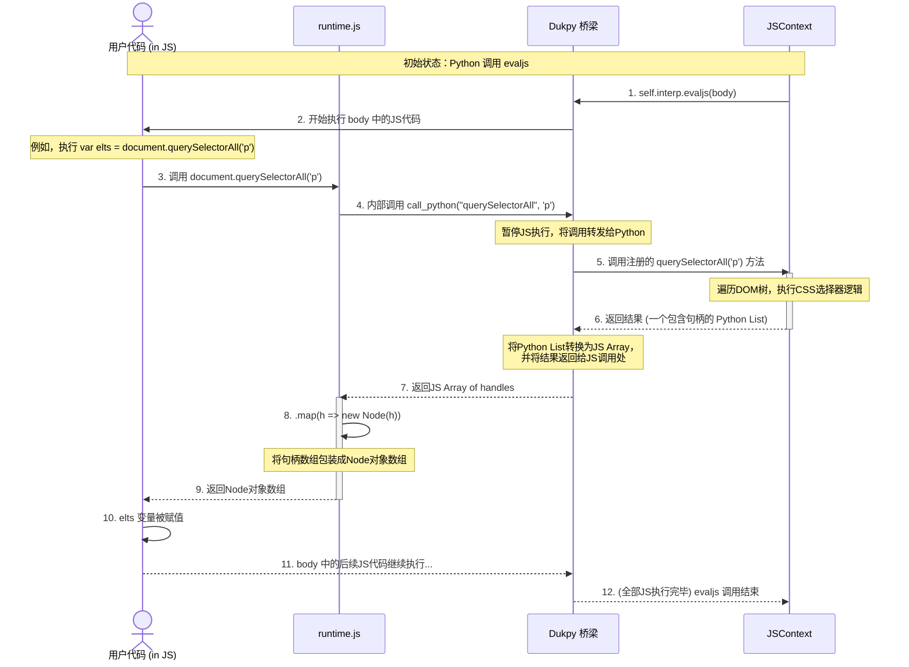

当执行 `self.interp.evaljs(body)` 后，如果JS代码中包含了对我们预设API的调用（如`document.querySelectorAll`），就会触发一次跨越Python和JavaScript世界的往返旅程。

下面是这个流程的时序图表示：

### 流程详解

1.  **Python 发起调用**: 流程始于 `JSContext.run` 方法中对 `self.interp.evaljs(body)` 的调用。
2.  **JS 代码执行**: `Dukpy` 开始在它的环境中执行 `body` 字符串里的JavaScript代码。
3.  **调用预设 API**: 当用户代码（如 `main.js`）执行到 `document.querySelectorAll('p')` 时，它实际上调用的是你在 `runtime.js` 里定义好的函数。
4.  **第一次跨越 (JS -\> Python)**: `runtime.js` 中的 `querySelectorAll` 函数的核心是 `call_python(...)`。`Dukpy` 捕获这个调用，暂停JS的执行，然后去调用在 `JSContext` 中注册的同名Python方法。
5.  **Python 处理**: `JSContext.querySelectorAll` 方法在Python世界里执行，它访问DOM树、进行计算，并返回一个包含结果（比如节点句柄列表）的Python对象。
6.  **第二次跨越 (Python -\> JS)**: `Dukpy` 拿到Python函数的返回值，将其转换为对应的JavaScript对象（比如一个JS数组）。
7.  **JS 处理返回结果**: `runtime.js` 拿到从Python返回的数据（句柄数组），可能会进行二次加工（比如通过 `.map` 将其包装成 `Node` 对象）。
8.  **返回给用户代码**: 经过包装的结果最终被返回给用户最初调用的地方，并赋值给变量（如 `elts`）。
9.  **流程结束**: 用户代码继续执行，直到所有JS代码执行完毕，`evaljs` 的整个过程才算结束。