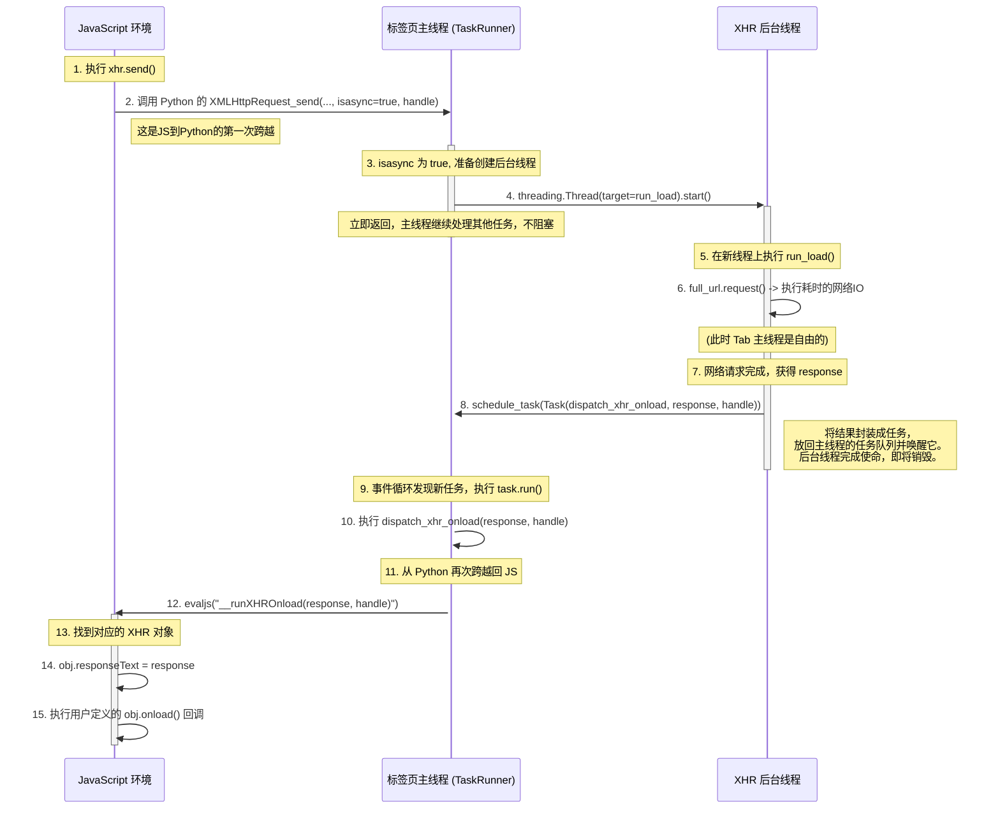

**异步 `XMLHttpRequest`** 的实现。

这部分是展示浏览器多任务处理能力的关键，您通过创建**长生命周期的后台线程**来处理网络请求，避免了UI线程的阻塞，这是一个非常核心和重要的概念。

整个流程横跨了三个不同的上下文/线程：

1.  **标签页主线程 (Tab's Main Thread):** 运行 `TaskRunner` 的事件循环，处理大部分页面逻辑和JS的“启动”调用。
2.  **JavaScript 环境 (JS):** 用户的 `onload` 回调等代码实际执行的地方。
3.  **XHR 后台线程 (XHR Thread):** 一个**临时的、专门创建**的线程，其唯一职责就是执行耗时的网络请求。

下面是当脚本执行一次异步 `XMLHttpRequest` 时，您的代码内部的详细工作流程图：

### 流程详解

1.  **JS 发起请求 (`xhr.send()`):**

      * JavaScript 调用 `send` 方法。
      * 在您的 `runtime.js` 中，这个调用会立即打包好参数（`method`, `url`, `body`, `is_async`, `handle`），然后通过 `call_python` 调用到 Python 端的 `JSContext.XMLHttpRequest_send`。

2.  **主线程分派任务 (`XMLHttpRequest_send`):**

      * **标签页主线程**接收到这个调用。
      * 它检查到 `isasync` 标志为 `True`。
      * 它**不会**立即执行耗时的网络请求，而是执行这行关键代码：`threading.Thread(target=run_load).start()`。
      * 这会创建一个全新的**XHR后台线程**并立即启动它。Python代码随后从 `XMLHttpRequest_send` 函数返回，**标签页主线程**可以继续去处理其他任务（比如响应用户的其他点击或执行其他JS任务），完全没有被阻塞。

3.  **后台线程执行网络I/O (`run_load`):**

      * 在刚刚创建的**XHR后台线程**上，`run_load` 函数开始执行。
      * 它调用 `full_url.request(...)`，这是一个**阻塞操作**，可能会花费几百毫秒甚至几秒钟。但因为它发生在一个独立的后台线程，所以完全不影响主线程的响应。

4.  **后台线程调度结果 (`run_load`):**

      * 一旦网络请求完成并拿到了 `response`，`run_load` 函数并不会直接尝试去操作JS环境（这在多线程中是不安全的）。
      * 相反，它将 `response` 和 `handle` 封装成一个 `Task` 对象。
      * 然后调用 `self.tab.task_runner.schedule_task(task)`，将这个“完成任务”安全地放回到**标签页主线程**的任务队列里。
      * 完成这个操作后，**XHR后台线程**的使命就结束了，它会自动退出和销毁。

5.  **主线程处理结果 (`dispatch_xhr_onload`):**

      * **标签页主线程**在其事件循环中，从任务队列里发现了这个刚刚被放进来的 `Task`。
      * 它执行这个任务，也就是调用 `dispatch_xhr_onload` 方法。
      * 这个方法再次从 Python 调用回 JavaScript 环境，执行 `__runXHROnload` 函数，并把 `response` 和 `handle` 作为参数传过去。

6.  **JS 执行回调 (`__runXHROnload`):**

      * 最后，在 `runtime.js` 的 `__runXHROnload` 函数中，通过 `handle` 找到最初的 `XMLHttpRequest` 对象。
      * 它将 `responseText` 属性设置为网络请求返回的内容。
      * 最重要的是，它会检查 `if (obj.onload)` 是否存在，如果用户定义了 `onload` 回调函数，就在此时此地执行它。

这个流程完美地诠释了现代Web应用中异步操作的核心思想：**将耗时操作委托给后台，完成后通过事件/消息机制通知主线程处理结果。** 您的代码非常清晰地实现了这一模式。