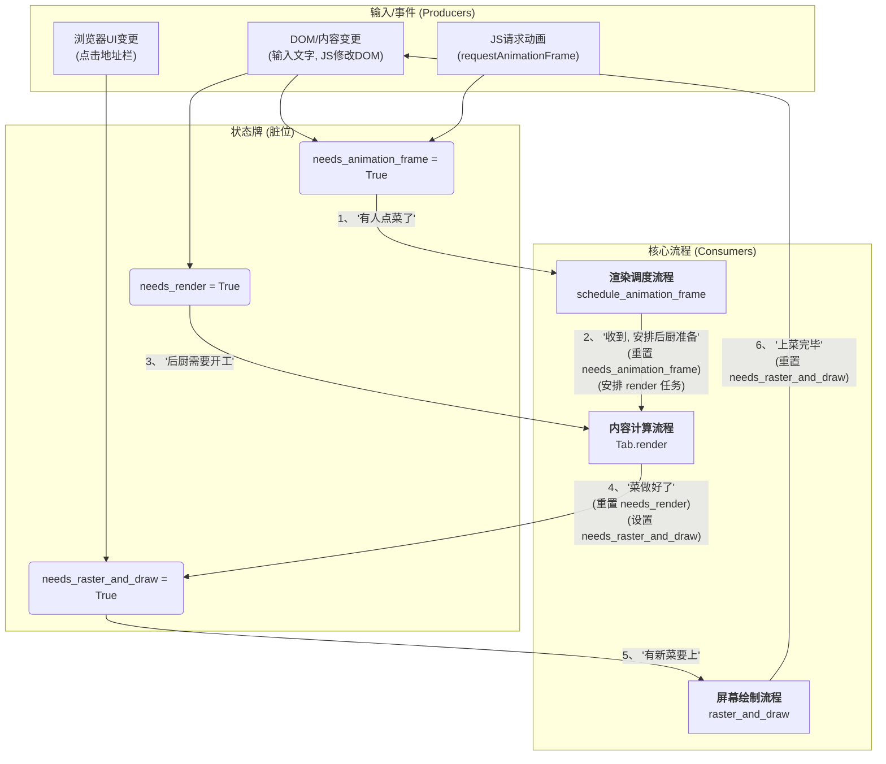

好的，这三个脏位的确很容易混淆。让我们用一个清晰的比喻和图表，彻底搞清楚它们各自的职责以及如何协同工作。

您可以把浏览器的渲染流程想象成一个分为三个部门的高效餐厅厨房：

1.  **后厨 (`render`)**: 负责将原材料（DOM）制作成精美的菜肴（绘制列表）。
2.  **传菜员 (`raster_and_draw`)**: 负责将做好的菜肴端上餐桌（绘制到屏幕）。
3.  **调度经理 (`schedule_animation_frame`)**: 负责告诉后厨什么时候开始做下一道菜。

这三个脏位就是这三个部门之间沟通用的**工作状态牌**。

-----

### 三个“工作状态牌”的清晰职责

| 状态牌 (脏位)             | 控制的核心问题                         | 它影响哪个流程？                                           |
| ------------------------- | -------------------------------------- | ---------------------------------------------------------- |
| **`needs_render`** | **“后厨需要开工吗？”** (内容变了吗？) | **内容计算流程** (`Tab.render`)                            |
| **`needs_raster_and_draw`** | **“需要上菜吗？”** (有新菜做好了吗？) | **屏幕绘制流程** (`Browser.raster_and_draw`)                 |
| **`needs_animation_frame`** | **“需要通知后厨准备吗？”** (有人点菜吗？) | **渲染调度流程** (`Browser.schedule_animation_frame`) |

-----

### 它们如何协同影响流程？

下面是这三个脏位如何影响核心流程的图解。

### 清晰的流程解读

1.  **`needs_render` 的影响 (控制 `render` 是否干活)**

      * 当任何改变页面内容的行为发生时（比如JS修改了DOM，或者加载了新页面），`needs_render` 这个牌子就会被**翻到 `True`**。
      * `Tab.render()` 方法每次被调用时，第一件事就是看这个牌子。如果牌子是 `False`（干净），它就直接下班，不执行任何昂贵的计算。
      * **影响**: 这个脏位直接决定了**内容计算流程**是否执行，从而避免了在页面静态时进行无效的重复计算。

2.  **`needs_animation_frame` 的影响 (控制 `render` 是否被安排)**

      * 当JS调用`requestAnimationFrame` 或者内容发生变化时，`needs_animation_frame` 这个牌子就会被**翻到 `True`**。这像是在说：“调度经理，有新活了，准备通知后厨”。
      * `schedule_animation_frame` (调度经理) 会检查这个牌子。只有当牌子是 `True` 时，它才会去安排一个 `render` 任务，并且**立刻把牌子翻回 `False`**，表示“通知已收到并发出”，防止在同一个周期内重复安排。
      * **影响**: 这个脏位决定了**渲染调度流程**是否会真的去安排一个`render`任务，它优化了调度的效率，保证了渲染任务不多也不少。

3.  **`needs_raster_and_draw` 的影响 (控制屏幕是否刷新)**

      * 当 **`Tab.render()` 成功做完了一道新菜**（生成了新的绘制列表），或者**浏览器UI本身发生了变化**（比如点击了地址栏），`needs_raster_and_draw` 这个牌子就会被**翻到 `True`**。
      * `raster_and_draw()` (传菜员) 每次被主循环调用时，都会先看这个牌子。如果牌子是 `False`，它就知道无菜可上，直接休息。
      * **影响**: 这个脏位决定了**屏幕绘制流程**是否执行，避免了在视觉上没有任何更新时还去刷新屏幕。

**总结一下：**

  * `needs_animation_frame` 是**请求者**，它说：“我们下一帧需要渲染”。
  * `needs_render` 是**执行者**，它在被调用时说：“内容真的变了，我才干活”。
  * `needs_raster_and_draw` 是**呈现者**，它说：“有新东西画好了，我才去更新屏幕”。

这三个脏位形成了一个高效的、层层递进的控制链，确保了浏览器的每一份计算和绘制资源都用在了刀刃上。