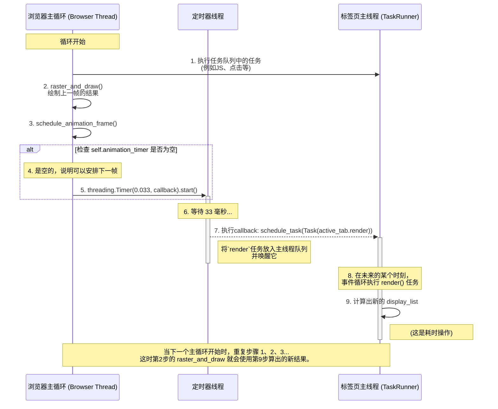

这段文字描述的是浏览器如何从一个“随叫随到”的渲染模式，演进为一个有固定“心跳”和“节奏”的渲染循环，以实现更流畅、更可控的动画效果。

其核心思想是：**将渲染的决定权从各个独立的 `Tab` 上收归到 `Browser` 中，由 `Browser` 统一按固定的时间间隔（这里是33毫秒，即每秒30帧）来发起渲染任务。**

这个流程巧妙地将 **`Browser` 线程** 和 **`Tab` 线程** 的工作串联了起来，下面是这个“渲染节奏”的流程图：

### 流程详解

1.  **主循环 (`mainloop`)**:

      * 浏览器的 `mainloop` 是一个持续运行的 `while True` 循环。
      * 在每次循环中，它会先尝试执行 `Tab` 线程任务队列中的任务（比如JS回调），然后调用 `raster_and_draw()` 将**上一帧**计算好的内容绘制到屏幕上。
      * 最关键的是，它**每次循环都会调用 `schedule_animation_frame()`**。

2.  **安排动画帧 (`schedule_animation_frame`)**:

      * 这个方法是“渲染节拍器”的心脏。它内部有一个 `if not self.animation_timer:` 的判断。
      * **第一次调用时**，`self.animation_timer` 是 `None`，于是它会立刻创建一个 `threading.Timer`，并设定它在 **33毫秒后** 执行 `callback` 函数。同时，它将这个定时器实例赋值给 `self.animation_timer`。
      * **在接下来的33毫秒内**，`mainloop` 仍然在飞速循环，但每次调用 `schedule_animation_frame` 时，因为 `self.animation_timer` **不再是 `None`**，所以什么都不会发生。这就保证了在33毫秒内，只会安排一次渲染任务。

3.  **定时器触发 (`callback`)**:

      * 33毫秒后，在那个临时的**定时器线程**里，`callback` 函数被触发。
      * 它的工作是：
          * 创建一个以 `active_tab.render` 为目标的 `Task`。
          * 将这个 `Task` 放入**标签页主线程**的 `TaskRunner` 队列中。
          * 将 `self.animation_timer` 重新设置为 `None`。

4.  **执行渲染 (`active_tab.render`)**:

      * **标签页主线程**在其事件循环中发现了这个新的渲染任务，于是开始执行 `render()` 方法。这是一个耗时操作，它会完成从样式计算到布局再到生成绘制列表（display list）的完整过程。

5.  **形成闭环**:

      * 当 `callback` 执行完毕后，`self.animation_timer` 已经变回了 `None`。
      * 这意味着，在下一次 `mainloop` 调用 `schedule_animation_frame` 时，第2步的条件又满足了，一个新的定时器会被再次创建，从而启动了下一轮的“33毫秒渲染周期”。

通过这个机制，浏览器实现了一个稳定的、以接近30fps为目标的渲染循环，将耗时的渲染计算（`render`）安排在独立的`Tab`线程中，而由`Browser`线程来控制其触发的节奏，确保了UI的流畅和动画的平滑。