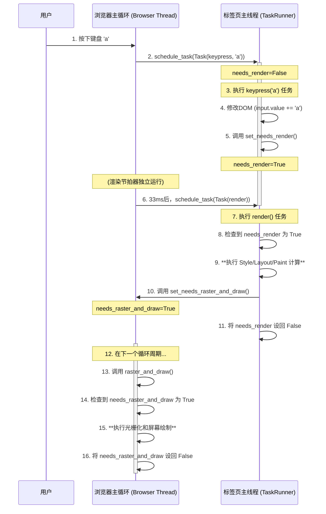
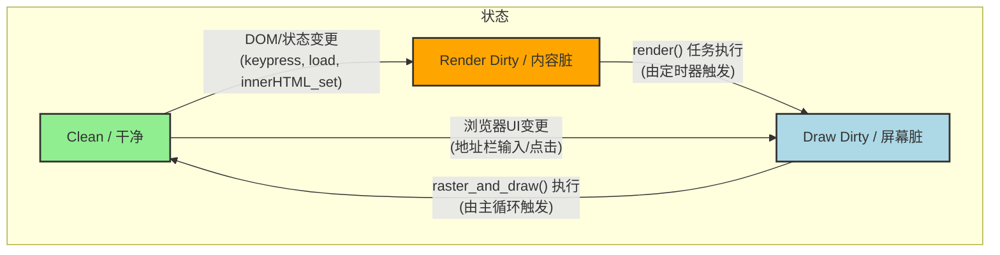

好的，我们来深入解析这两个对性能至关重要的“脏位” (`needs_render` 和 `needs_raster_and_draw`)。

-----

### 1\. `needs_render` (内容是否需要重新计算？)

这个脏位是**内容层面的**，它关心的是页面的DOM结构和样式是否发生了变化，需不需要重新进行昂贵的`render`计算（包括 Style → Layout → Paint）。

  * **它的目的**: 避免在网页内容完全没变的情况下，一遍又一遍地重复计算布局和绘制列表。

  * **哪里是生产者 (设置为 `True`)?**

      * **生产者是所有会改变DOM或其状态的行为**。在您的代码中，这些地方调用了 `set_needs_render()`：
          * `Tab.load()`: 加载一个全新的页面，DOM被完全替换。
          * `JSContext.innerHTML_set()`: JavaScript修改了某个元素的内部HTML。
          * `Tab.click()`: 点击事件可能导致元素状态改变（如焦点变化），需要重新渲染。
          * `Tab.keypress()`: 在输入框里打字，改变了input元素的`value`属性，需要重绘。

  * **哪里是消费者 (设置为 `False`)?**

      * **消费者是 `Tab.render()` 方法本身**。当它被调用并成功完成了所有计算后，它会在方法的最后一行将 `self.needs_render = False`。这表示：“我已经根据最新的DOM状态计算好了，现在内容是‘干净’的了，在下一次被弄脏之前，别再让我重复工作。”

-----

### 2\. `needs_raster_and_draw` (屏幕是否需要重绘？)

这个脏位是**屏幕层面的**，它不关心内容是怎么算出来的，只关心“有没有新的东西需要在屏幕上画出来”。

  * **它的目的**: 避免在整个浏览器窗口（包括浏览器UI和网页内容）在视觉上没有任何变化时，还去执行光栅化和绘制操作。

  * **哪里是生产者 (设置为 `True`)?**

      * **生产者有两个来源**:
        1.  **浏览器UI发生了变化**: 当用户与浏览器顶部的地址栏、按钮交互时，`Browser`类中的事件处理器会调用 `set_needs_raster_and_draw()`。比如 `handle_click`, `handle_key`, `handle_enter`。
        2.  **网页内容计算出了新结果**: 这是关键！当 `Tab.render()` 方法成功生成了一个新的绘制列表后，它会调用 `self.browser.set_needs_raster_and_draw()`。这个动作像是在说：“我已经准备好了一份新的网页图纸，通知浏览器，你该把它画出来了！”

  * **哪里是消费者 (设置为 `False`)?**

      * **消费者是 `Browser.raster_and_draw()` 方法本身**。当它成功将浏览器UI和网页内容都绘制到屏幕上后，它会在最后一行将 `self.needs_raster_and_draw = False`。这表示：“屏幕已经更新到最新状态了，现在是‘干净’的，在下一次被通知有新东西要画之前，别再调用我。”

-----

### 案例时序图：用户在输入框输入一个字符

这张图详细展示了用户输入字符 `'a'` 后，两个脏位如何协同工作，完成一次从输入到屏幕更新的完整流程。

-----

### 整体流程图 (状态机)

这张图从宏观上展示了浏览器在这两个脏位的控制下的三种核心状态以及它们之间的转换关系。

1.  **初始/默认状态是 `Clean`**: 浏览器处于待机状态，不执行任何昂贵的计算。
2.  当任何**改变网页内容**的行为发生时，状态切换到 `Render Dirty`。
3.  当渲染节拍器触发 `render()` 任务并成功执行后，内容计算完成，状态切换到 `Draw Dirty`，等待被绘制。
4.  当**浏览器UI本身**发生变化时，由于不涉及内容重新计算，状态会直接从 `Clean` 切换到 `Draw Dirty`。
5.  最后，当主循环执行了 `raster_and_draw()`，将所有新内容绘制到屏幕上后，一切又回归 `Clean` 状态，等待下一次的变更。