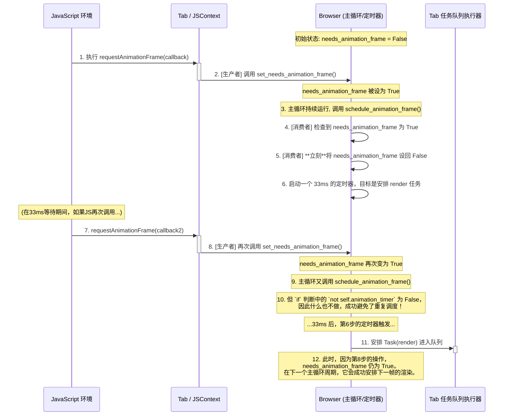

好的，我们来专门聚焦 `set_needs_animation_frame` 这个脏位，它在优化渲染调度中扮演着“看门人”的角色。

### `needs_animation_frame` 脏位详解

这个脏位是**调度层面的**，它不关心内容是否变化，也不关心屏幕是否需要重绘，它只关心一个问题：

> **“在下一个33毫秒的节拍到来时，我们是否有必要去安排一次 `render` 任务？”**

  * **它的目的**: 避免在单个渲染周期内（33毫秒内）重复安排多个 `render` 任务。它确保了即使有100个 `requestAnimationFrame` 调用，也只会触发一次 `render` 任务的调度，从而防止任务队列被不必要的 `render` 任务淹没。

-----

### 生产者与消费者

  * **哪里是生产者 (设置为 `True`)?**

      * **生产者是任何“希望”在下一帧触发渲染的行为**。它将 `needs_animation_frame` 标志举起，像是在说：“嘿，浏览器，下一帧有活要干了！”
      * 在您的代码中，有两个地方会调用 `set_needs_animation_frame`，从而生产这个状态：
        1.  `Tab.set_needs_render()`: 当DOM内容发生变化（比如加载页面、输入文字）时，它在设置 `needs_render = True` 的同时，也会设置 `needs_animation_frame = True`。因为它知道，既然内容变了，那下一帧肯定需要渲染。
        2.  `JSContext.requestAnimationFrame()`: 当JavaScript直接请求动画帧时，它会调用 `set_needs_animation_frame`，明确地表达了“我希望在下一帧搞点事情”的意图。

  * **哪里是消费者 (设置为 `False` 或被检查)?**

      * **唯一的消费者是 `Browser.schedule_animation_frame()` 方法**。它在做决定时会“消费”或检查这个状态。
      * 流程是这样的：
        1.  **检查**: `schedule_animation_frame` 的核心判断是 `if self.needs_animation_frame and not self.animation_timer:`。它首先检查这个脏位，如果不是 `True`，就直接跳过，什么也不做。
        2.  **消费 (重置)**: 一旦检查通过，并且它成功地启动了一个新的 `threading.Timer` 来安排 `render` 任务，它会**立刻**将 `self.needs_animation_frame` 设置回 `False`。这个动作至关重要，它表示：“请求我已经收到了，并且已经安排下去了。现在我把旗子放下来，在这个定时器触发之前，不要再来烦我了。”

-----

### `needs_animation_frame` 流程时序图

这张图清晰地展示了当JS调用 `requestAnimationFrame` 后，这个脏位是如何被生产和消费的，从而实现高效的调度。

这个流程清晰地展示了 `needs_animation_frame` 如何像一个智能的门锁一样工作：

  * 任何渲染请求都能把锁“打开”（设置为`True`）。
  * 一旦 `schedule_animation_frame` 响应了一次请求并派出了任务，它会立刻把锁“关上”（设置为`False`），确保在当前调度周期内不会有重复的任务被派出。
  * 这种机制保证了渲染任务的安排既不会被遗漏，也不会被过度执行。