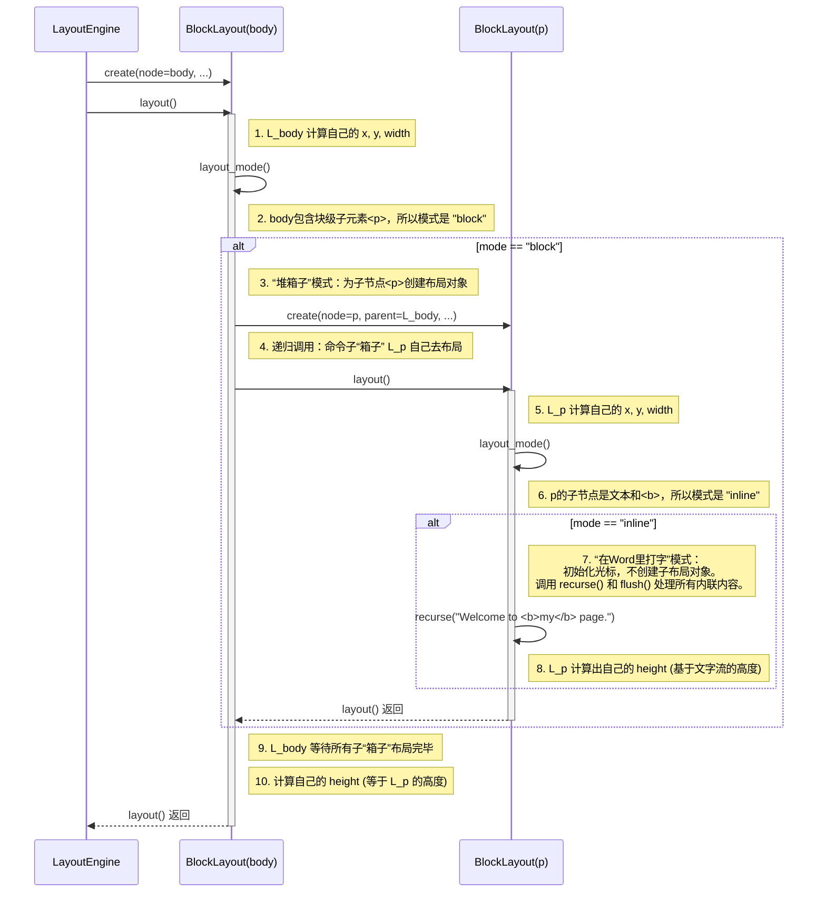

### HTML 示例

我们将使用这个简单而经典的 HTML 结构。它包含了块级元素和内联元素，足以触发代码中所有的核心逻辑。

```html
<body>
  <p>
    Welcome to <b>my</b> page.
  </p>
</body>
```

**涉及的节点**:

  * `<body>` 元素 (块级)
  * `<p>` 元素 (块级)
  * `"Welcome to "` (文本节点, 内联)
  * `<b>` 元素 (内联)
  * `"my"` (文本节点, 内联)
  * `" page."` (文本节点, 内联)

### 参与者说明

在时序图中，我们会看到以下几个参与者：

  * **LayoutEngine**: 代表调用布局流程的外部引擎。
  * **L\_body**: 为 `<body>` 节点创建的 `BlockLayout` 对象实例。
  * **L\_p**: 为 `<p>` 节点创建的 `BlockLayout` 对象实例。

### Layout 过程时序图

下面的图详细描绘了从 `LayoutEngine` 开始，到所有元素布局完成的每一步调用和返回过程。



