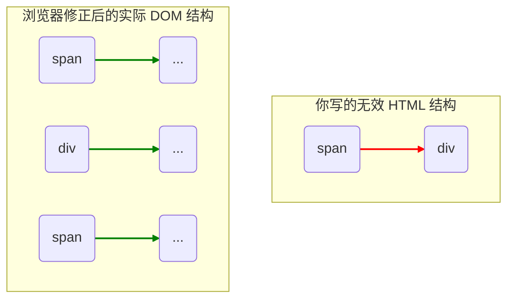

### 一个 `inline` 节点，他的子节点也可以是 `block` 的吗？

这是一个非常关键的问题！我们得分两种情况来看：

#### 1\. 在我们正在分析的这段代码中，答案是“不能”

这段代码非常聪明地**阻止**了这种情况的发生。让我们再看一下 `layout_mode` 的判断逻辑：

```python
def layout_mode(self):
    # ...
    elif any([isinstance(child, Element) and \
              child.tag in BLOCK_ELEMENTS
              for child in self.node.children]):
        return "block" # <--- 关键在这里！
    elif self.node.children:
        return "inline"
    # ...
```

这段代码的第二个判断条件 `elif any(...)` 建立了一条非常重要的规则：

**“只要我的子节点中，有任何一个被认为是块级元素（`BLOCK_ELEMENTS`），那么我自己的 `layout_mode` 就必须是 `block`。”**

这意味着，一个节点**不可能**在 `layout_mode` 返回 `inline` 的同时，还拥有一个块级的子节点。如果它有块级子节点，它的模式就已经被强制切换为 `block` 了。

这可以看作是代码的一种**自我修正或规范化**行为，它主动避免了“内联元素包含块级元素”这种不稳定的结构。

#### 2\. 在真实的 HTML 和 CSS 规范中，这也是“不允许的”

你的代码实现，恰好模拟了真实世界浏览器的一个核心规则。HTML 规范定义了元素的“内容模型”（Content Model），其中规定：

> **内联元素（Inline elements）不能直接包含块级元素（Block-level elements）。**

例如，这样的 HTML 是**无效**的：

```html
<span style="border: 1px solid red;">
  <div style="border: 1px solid blue;">我是一个 div</div>
</span>
```

当你把这段无效代码扔给浏览器时，浏览器不会直接渲染它，而是会先进行“容错处理”（也叫“修补标签”或“Tag Soup”修复）。它会重构 DOM 树，结果看起来会像这样：

```html
<span style="border: 1px solid red;"></span>
<div style="border: 1px solid blue;">我是一个 div</div>
<span style="border: 1px solid red;"></span>
```

浏览器会把 `<span>` 在 `<div>` 开始的地方打断，并在 `<div>` 结束后再重新开始，以确保“块级元素不能在内联元素里”这条规则得到遵守。

我们可以用图来展示这个修正过程：



### 总结

1.  一个节点的 `layout_mode` 决定了其**内部的布局规则**，这既影响**子节点的排列**，也影响**节点自身的高度计算**。
2.  无论是你的这段代码实现，还是真实的 HTML 规范，都**不允许**一个内联格式化上下文（inline mode）中直接包含块级子节点。你的代码通过**强制将父元素切换到 `block` 模式**来巧妙地实现了这一规则。