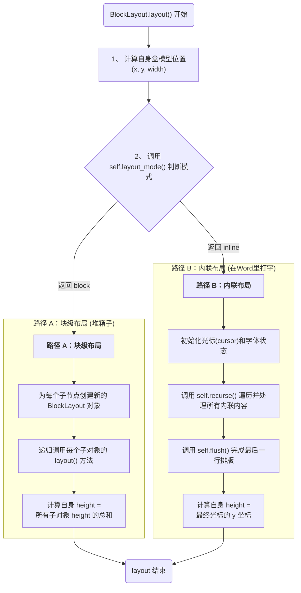

```mermaid
graph TD
    A("BlockLayout.layout() 开始") --> B["1、 计算自身盒模型位置<br/>(x, y, width)"];
    B --> C{"2、 调用 self.layout_mode() 判断模式"};
    C -- 返回 block --> D[<b>路径 A：块级布局</b>];
    C -- 返回 inline --> E[<b>路径 B：内联布局</b>];

    subgraph "路径 A：块级布局 (堆箱子)"
        D --> D1[为每个子节点创建新的 BlockLayout 对象];
        D1 --> D2["递归调用每个子对象的 layout() 方法"];
        D2 --> D3[计算自身 height =<br/>所有子对象 height 的总和];
    end

    subgraph "路径 B：内联布局 (在Word里打字)"
        E --> E1["初始化光标(cursor)和字体状态"];
        E1 --> E2["调用 self.recurse() 遍历并处理所有内联内容"];
        E2 --> E3["调用 self.flush() 完成最后一行排版"];
        E3 --> E4[计算自身 height =<br/>最终光标的 y 坐标];
    end

    D3 --> Z("layout 结束");
    E4 --> Z;
```