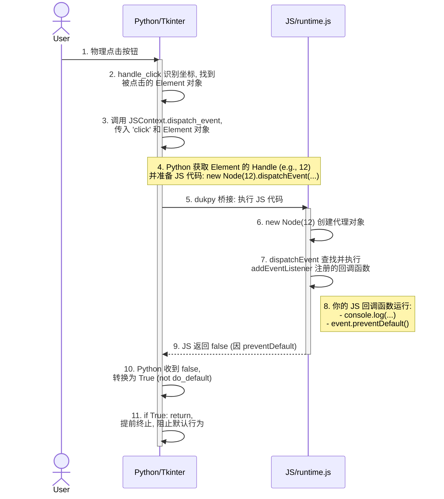

### **第 1 步：用户点击 (Python/Tkinter 的世界)**

1. 用户在屏幕上渲染出的“点我”按钮上进行物理点击。
2. **Tkinter**，作为 Python 的图形界面库，探测到了这个动作。它不理解什么是 HTML 或按钮，它只知道在某个 `(x, y)` 坐标上发生了一次鼠标点击事件 (`<Button-1>`)。
3. `Browser` 类有一个事件绑定监听这个动作：`self.window.bind("<Button-1>", self.handle_click)`。
4. 因此，`Browser.handle_click(self, e)` 方法被执行。事件对象 `e` 中包含了点击的 `x` 和 `y` 坐标。

### **第 2 步：Python 识别目标**

`handle_click` 方法的任务是弄清楚_什么东西_被点击了。

1. 它判断出这次点击发生在内容区域（而不是地址栏）。
2. 它调用 `self.active_tab.click(e.x, tab_y)`。
3. `Tab.click` 方法是魔法开始的地方。它将屏幕坐标转换为页面坐标，并找到位于该位置的具体 DOM 元素。
4. 它遍历布局树，找到我们 `<button>` 对应的 `BlockLayout` 对象，然后获取到代表按钮的、真实的 `Element` 节点对象。
5. 现在，Python 知道了：**用户点击的是 `<button>` 元素对象**。

### **第 3 步：Python 通知 JavaScript 世界**

这是至关重要的交接环节。

1. 在 `Tab.click` 内部，代码找到了按钮元素 (`elt`)，并立即调用：
    
    ```python
    if self.js.dispatch_event("click", elt): return
    ```
    
2. 这会调用 `JSContext` 对象中的 `dispatch_event` 方法，并传入事件类型 `"click"` 和代表 `<button>` 元素的 Python 对象。

### **第 4 步：`dukpy` 桥梁 (Python -> JS)**

`JSContext.dispatch_event` 方法扮演了桥梁的角色：

1. **获取句柄 (Handle):** 它首先为这个按钮元素获取一个唯一的整数 ID，通过调用 `self.get_handle(elt)`。我们假设这个按钮的句柄是 `12`。
2. **准备 JS 代码:** 它使用一段预先定义好的 JavaScript 代码片段：
    
    ```javascript
    // 在 browser.py 中的 EVENT_DISPATCH_JS
    "new Node(dukpy.handle).dispatchEvent(new Event(dukpy.type))"
    ```
    
3. **执行 JS:** 它调用 `self.interp.evaljs(...)`，这个命令会告诉 `dukpy` 的 JavaScript 解释器去执行那段代码。同时，它将 Python 中的变量 `handle=12` 和 `type="click"` 注入到 JS 作用域的 `dukpy` 对象中。

所以，最终在 JavaScript 解释器内部实际运行的代码是：

```javascript
new Node(12).dispatchEvent(new Event("click"));
```

### **第 5 步：在 runtime.js 中处理事件**

现在我们完全进入了 JavaScript 的世界。

1. `new Node(12)`: [runtime.js] 中的 `Node` 构造函数被调用。它创建一个新的 JavaScript `Node` 对象，并将句柄保存在内部（例如 `this.handle = 12`）。这个 JS 对象是 Python 中真实元素的一个**代理 (Proxy)**。
2. `dispatchEvent(new Event("click"))`: 这个方法在我们刚创建的 `Node` 代理对象上被调用。
3. **查找监听器:** `dispatchEvent` 方法会查找 `Node` 对象内部的一个私有属性，我们称之为 `_listeners`。`addEventListener` 正是在这里存储了我们之前注册的回调函数。它找到了 `'click'` 事件对应的条目，并看到了关联的函数：`(event) => { console.log('按钮被点击了!'); ... }`。
4. **执行监听器:** 它调用这个函数！
    - `console.log(...)` 被执行。记住，`log` 函数是从 Python 导出的 (`self.interp.export_function("log", print)`)，所以这个调用会通过桥梁**传回** Python，最终 "按钮被点击了!" 这句话会出现在你的终端里。
    - `event.preventDefault()` 被调用。这会在 `event` 对象上设置一个标志，比如 `this.defaultPrevented = true`。

### **第 6 步：返回 Python 的旅程 (JS -> Python)**

1. `[runtime.js]` 中的 `dispatchEvent` 函数执行完毕。因为 `preventDefault()` 被调用了，所以它返回 `false`。
2. 这个 `false` 值成为了 Python 中 `self.interp.evaljs(...)` 调用的结果。
3. Python 的 `JSContext.dispatch_event` 方法接收到 `false`，它的逻辑是 `return not do_default`。所以，它返回 `not false`，也就是 `True`。
4. 我们现在回到了 Python 的 `Tab.click` 方法中。`if self.js.dispatch_event("click", elt): return` 这行代码就变成了 `if True: return`。
5. `return` 语句被执行，`Tab.click` 方法立即终止。这就是 `preventDefault()` 实现其功能的方式：通过提前返回，它阻止了 Python 去执行按钮的默认行为（比如提交表单）。


## 时序图


