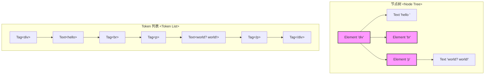

简单来说，如果仅停留在词法分析得到的 `[Tag(div), Text(hello), ...]` 这种一维的“词法单元（Token）”列表，而没有构建成节点树，后续几乎所有关键操作都将变得极其复杂和低效，甚至无法实现。

核心不便在于：**一维的 Token 列表完全丢失了 HTML 代码的“层级结构（Hierarchy）”**。

HTML 的本质不是一个线性的文本流，而是一个“谁包含谁”的嵌套结构。节点树（比如 DOM 树）完美地表达了这种结构，而 Token 列表则没有。

我们可以通过一个图来直观地对比一下：

从上图可以看出，节点树清晰地展示了 `div` 是父节点，它包含了三个子节点：一个文本节点、一个 `br` 节点和一个 `p` 节点。而 Token 列表只是一个线性的、无差别的序列。

具体来说，这种结构缺失会导致以下致命的不便：

### 1\. 无法应用 CSS 样式和布局

CSS 的核心是**选择器（Selector）**，而几乎所有非基础的选择器都依赖于节点之间的结构关系。

  - **后代选择器 (`div p`)**：需要找到所有 `div` 节点，并遍历它的所有子孙节点，看其中有没有 `p` 节点。在 Token 列表里，你无法知道 `p` 是不是在 `div` *内部*，你只知道它们出现的先后顺序。
  - **子代选择器 (`div > p`)**：需要找到 `div` 节点的直接子节点。这在树结构中轻而易举，但在 Token 列表里几乎是不可能完成的任务。
  - **伪类选择器 (`p:first-child`)**：需要判断一个 `p` 节点是不是其父节点的第一个子节点。在 Token 列表里，你甚至都不知道“父节点”是谁。

\*\*布局（Layout）\*\*更是如此。浏览器需要计算“盒子模型”，知道哪个盒子在哪个盒子里面，才能确定它们的大小、位置、边距等。节点树就是这个“大盒子套小盒子”的设计蓝图。没有树，就无法构建布局。

### 2\. JavaScript 的 DOM 操作无法进行

我们常用的所有 DOM API 都完全建立在节点树之上。

  - `document.querySelector('div > p')`: 如何在 Token 列表中实现这个查找？你需要自己写一套复杂的算法，用栈来模拟节点的进出，去手动重建局部的树结构，效率极低且容易出错。
  - `element.appendChild(newElement)`: 如何在一个 Token 列表中“添加一个子节点”？你需要找到父节点的结束标签 `</tag>` 的位置，然后把新节点的 Token 序列插入进去。如果逻辑复杂，比如 `p` 标签内不允许嵌套 `div`，这种规则在 Token 层面很难校验，但在树结构中就很清晰。
  - `element.parentElement` / `element.children`: 获取父节点和子节点列表。这些在树结构里只是简单的指针引用，在 Token 列表里则完全不存在这些概念。

### 3\. 事件冒泡和捕获机制失效

JavaScript 的事件流（Event Flow），包括从外到内的“捕获”和从内到外的“冒泡”，都依赖于清晰的父子链条。当你点击一个元素时，事件会沿着它的父节点一路向上传播到根节点。

在节点树中，这个传播路径是明确的：`Element -> parentElement -> parentElement -> ...`。
在 Token 列表中，没有“父节点”的概念，因此整个事件模型将不复存在。

### 总结

因此，**生成节点树不是一个可选项，而是将一维的文本代码转化为可操作的、结构化的文档对象的唯一方式**，是后续所有浏览器工作的基础。